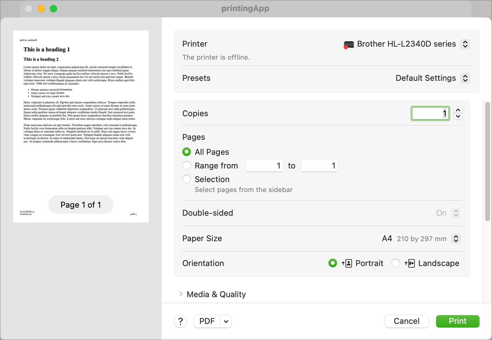

When I started trying to write a Mac app for the first time, I started out knowing what I wanted to achieve but not knowing how to go about it. I spent a lot of time googling for Mac development help and found very little of it. What i did find was mostly related to Objective-C and not Swift/SwiftUI.

So, I spent a lot of time going round in circles, extracting the bits that I thought relevant and heading down a lot of blind alleys.

This project is part of a series of development notes I want to write to document some of the stuff I learnt along the way. The note that goes with it can be found on my web site.

 [Printing HTML and Markdown](http://www.sabarnett.co.uk/blogPage.php?id=printing)

Printing is a very complex issue to solve. There are lots of articles about printing none of which seem to be complete or to deal with printing in a MacOS app. My specific need was to be able to print a MarkDown document, which is not straight forward. My solution was to convert the MarkDown to HTML and use existing built-in mechanisms handle the printing, adding headers and footers.

